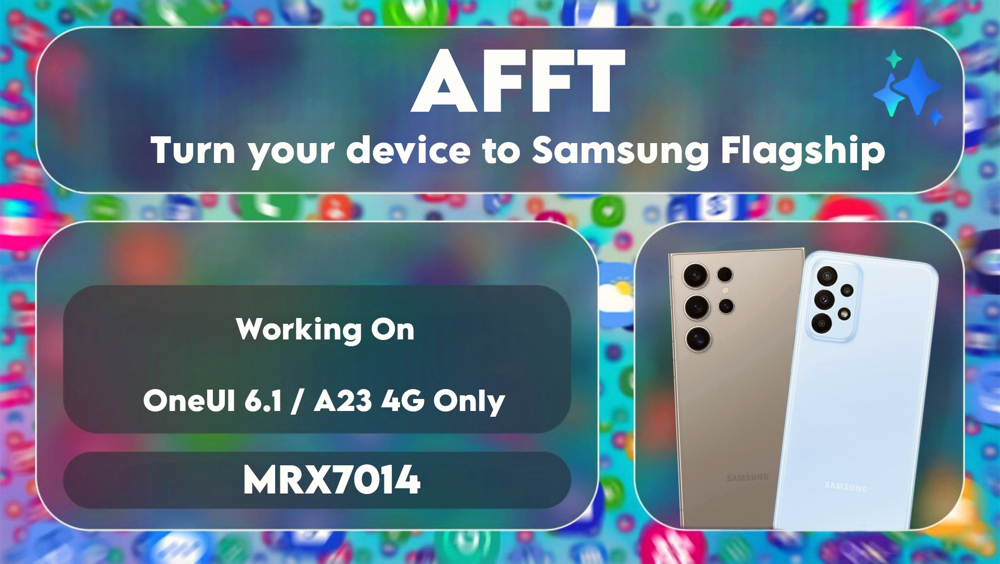

# AFFT - Turn your Scamsung glyax a23 to Samsung Galaxy A23 Ultra

  
**A Magisk Module To Enable Samsung Flagship Devices Features on Samsung A23 4G**

**Working on OneUI 6.1 Only**
**Working on A23 4G Only**

 

# V9.0.0 Released

### ⚙️ Installation:
1. Download the module from the releases
2. Open the Magisk/KernelSU app and go to modules
3. Click the "Install from storage" button and select the .zip you just downloaded
4. After module installation finished you MUST install [S24Ultra Spoofer Module](https://github.com/mrx7014/S24Ultra-Spoofer/releases)
5. Done

### ❔ Troubleshooting:
- Back Camera 1080p 60FPS Video stutters: Disable "Auto FPS" and "Stabilization"
- Camera app crashes (or other issues like error on 50MP mode): Clear camera app data.
- System apps crashing: Boot into TWRP/PBRP/OFOX Recovery and on
  
  ***Stock recovery***
  1. Wipe cache partition 
  

  ***Custom recovery***
  1. Wipe cache partition 
  2. Wipe dalvik cache 

- To fix Samsung Health root detection, I recommend using [KnoxPatch](https://github.com/salvogiangri/KnoxPatch)

### 🪲 Known bugs
- Please report here or in Telegram, if you find any

### ✨️Features:

⚙️System:
- High-End Animations
- Performance Profile
- Processing Speed
- Better Responsiveness & Speed
- Smooth UI & Scroll
- Reduce Lags
- Save Battery Without Performance Drop
- Dolby Atmos without Headsets
- Dolby Atmos in Games
- Dolby Atmos Game Profiles
- Flagship Edge Ligthining+
- Multi Users
- Screen Recorder
- Mic Focus Mode
- Camera Tweaks
- Faster streaming videos
- Disables built in error reporting
- Disables logcat
- Vulkan as default rendering driver
- Disable Locating
- Safetynet (Maybe not working well)
- Battery Information
- Instant Slow Motion in Gallery
- Enhanced CPU Responsiveness
- Photo Remaster
- Generative AI Wallpaper
- Almost all AI features (Missing SPen stuff)
- China Smart Manager
- Samsung Galaxy S24 Boot Animation
- Enable more Screen recorder features

⚡DT Tweaks:
- Faster boot time
- Better Responsiveness & Speed
- FPS Stabilizer
- Disables sending of usage data
- Makes apps load faster and frees more ram.
- Save Battery Without Performance Drop
- Change Default Rendering Driver
- Better RAM Management
- Disable Hungry GMS
- Aggressive Ram Killer (Prop)
- Kernel Tweaks For Better Battery Usage
- Zram Setting
- Stop Send Logs
- Enable Hardware Acceleration for Graphics Rendering

⚡YAKT Features:
- Reduces Jitter and Latency
- Optimizes Ram Management
- Disables scheduler logs/stats
- Disables printk logs
- Disables SPI CRC
- Tweaks mglru
- Allows sched boosting on top-app tasks (Thx to tytydraco)
- Tweaks uclamp scheduler (Credits to darkhz for uclamp tweak)
- Sets -20 (highest priority) for the most essential processes
- Uses Google's schedutil rate-limits from Pixel 3- Update Vulkan Verison to 1.3

📷Camera:
- Support Scene Optimizer
- Live Focus
- Intelligent features
- VDIS+Tracking AF
- Pro Video
- Super Steady
- Hyperlapse
- Post Processing Features
- camera assistant
- Improved HDR
- Motion Photo
- Full Beauty features (Beauty in Live Focus, Beauty Brighten, Body Beauty, change skin tone)
- Torch Flash in Live Focus
- Review feature
- Audio Input Control in "PRO video" mode
- Improved Scene Detection
- Video Audio Zoom
- Full Intelligent Recognition (like Smart Scan Text Extraction)
- Full Live Focus (all S-Series effects)
- Higher Gallery Zoom Quality
- Video Auto FPS

 

# Credits:

<a href="https://t.me/A235channel">**A23 Telegram Channel**</a>
